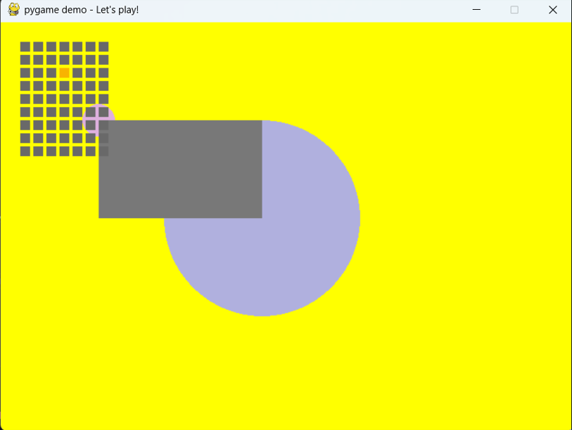

# pygame_samples
## demo_01.py

### ステップ２
 ウィンドウの大きさ
>~~~
>screen = pygame.display.set_mode([700, 500])
>~~~

ウィンドウの名前
>~~~
>pygame.display.set_caption("pygame demo - Let's play!")
>~~~

ウィンドウの背景の色
>~~~
> screen.fill((255, 255, 0))  # back ground color
>~~~

図形の色、座標、大きさ
大きい円
>~~~
>pygame.draw.circle(screen, (100, 100, 200), (500, 300), 150)
>~~~
小さい円
>~~~
>pygame.draw.circle(screen, (222, 176, 222), (120, 120), 20)
>pygame.draw.circle(screen, (222, 176, 222), (120, 120), 20)
>~~~
四角
>~~~
>pygame.draw.rect(screen, (120, 120, 120), Rect(120, 120, 200, 120))
>~~~

動く点（四角）のon offの色
>~~~
>color_on = (248, 180, 0)
>color_off = (105, 105, 105)
>~~~

動く点（四角）の縦、横の数
横
>~~~
> for x0 in range(7):
>~~~
縦
>~~~
>for y0 in range(9):
>~~~

Before

After
