# pygame_samples
## demo_01.py

### ステップ２

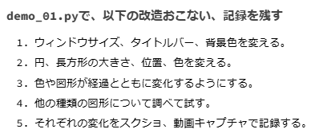
 
 ウィンドウの大きさ
 前
>~~~
>screen = pygamne.display.set_mode([640,480])
>~~~
後
>~~~
>screen = pygame.display.set_mode([700, 500])
>~~~

ウィンドウの名前
前
>~~~
>pygame.display.set_caption("pygame demo - window title here")
>~~~
後
>~~~
>pygame.display.set_caption("pygame demo - Hello!")
>~~~

ウィンドウの背景の色
前
>~~~
>screen.fill((238, 238, 170))
>~~~
後
>~~~
>screen.fill((255, 255, 0))
>~~~

図形の（左から）色、座標、大きさ
大きい円 前
>~~~
>pygame.draw.circle(screen, (176, 176, 222), (500, 240), 120)
>~~~
大きい円　後
>~~~
>pygame.draw.circle(screen, (100, 100, 200), (500, 300), 150)
>~~~
小さい円（二つ）　前
>~~~
>pygame.draw.circle(screen, (222, 176, 222), (120, 120), 20)
>pygame.draw.circle(screen, (222, 176, 222), (120, 120), 20)
>~~~
小さい円　後
>~~~
>pygame.draw.circle(screen, (255, 0, 0), (300, 100), 30)
>pygame.draw.circle(screen, (255, 0, 255), (300, 150), 30)
>~~~
四角　前
>~~~
>pygame.draw.rect(screen, (120, 120, 120), Rect(120, 120, 200, 120))
>~~~
四角　後
>~~~
>pygame.draw.rect(screen, (0, 128, 0), Rect(100, 100, 100, 200))
>~~~

動く点（四角）のon offの色
>~~~
>color_on = (248, 180, 120)
>color_off = (105, 105, 105)
>~~~

動く点（四角）の縦、横の数
横
>~~~
> for x0 in range(7):
>~~~
縦
>~~~
>for y0 in range(9):
>~~~

Before
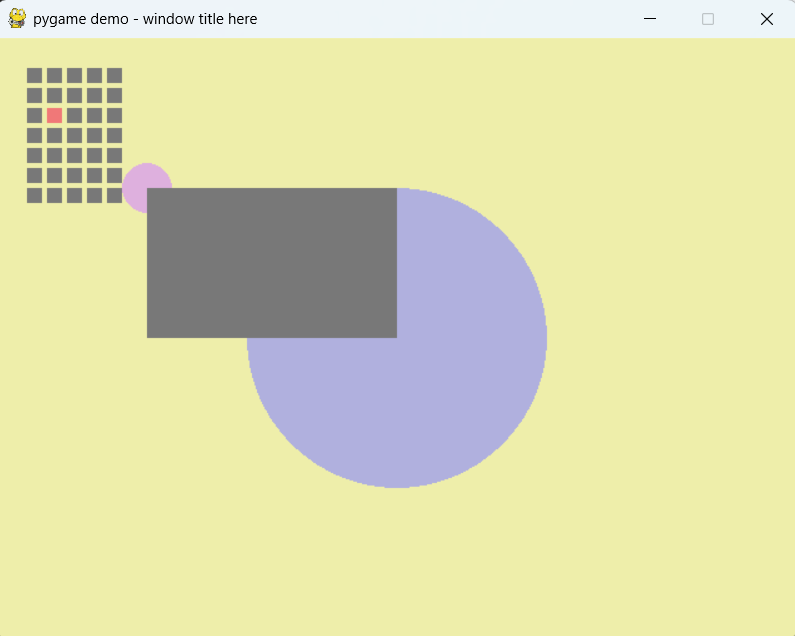

After
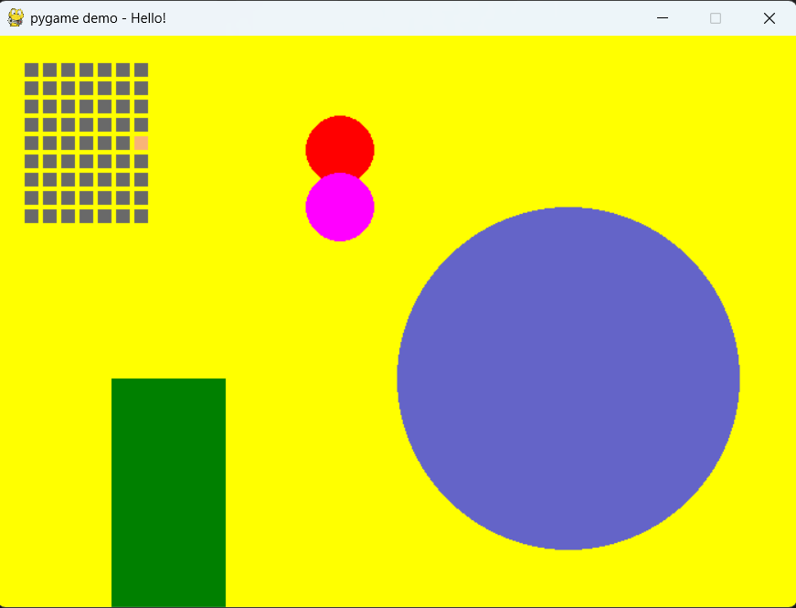

### ステップ３

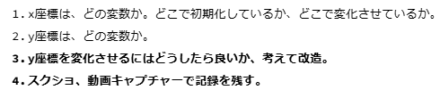

x座標を増やす（点を動かす）
>~~~
>x1 += 1
>~~~

端についたら下の段に行くようにする　前
>~~~
>if x1 > 4:
>    x1 = 0
>~~~
後
>~~~
>if x1 > 6:
>    x1 = 0
>    y1 += 1
>~~~

一番下についたら一番上に戻る
>~~~
>if y1 > 8:
>    y1 = 0
>~~~

Before
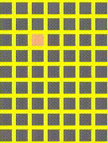

After
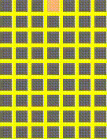

### demo_LCD_font.py
#### ステップ４

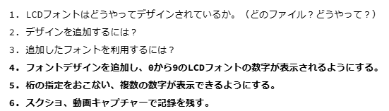

ウィンドウの大きさ
前
>~~~
>WINDOW_WIDTH = 320
>WINDOW_HEIGHT = 240
>~~~
後
>~~~
>WINDOW_WIDTH = 700
>WINDOW_HEIGHT = 240
>~~~

小さい数字の座標移動
前
>~~~
>x_change = 0
>~~~
後
>~~~
>x_change = 1
>~~~

右端についたら左へ戻る
前
>~~~
>if x < 0:
>            x = 0
>~~~
後
>~~~
>if x > 690:
>            x = 0
>~~~

数字のフォント
>~~~
>LCD_0 = (0, 1, 1, 1, 0,
>         1, 0, 0, 0, 1,
>         1, 0, 0, 1, 1,
>         1, 0, 1, 0, 1,
>         1, 1, 0, 0, 1,
>         1, 0, 0, 0, 1,
>         0, 1, 1, 1, 0)
>
>LCD_1 = (0, 0, 1, 0, 0,
>         0, 1, 1, 0, 0,
>         0, 0, 1, 0, 0,
>         0, 0, 1, 0, 0,
>         0, 0, 1, 0, 0,
>         0, 0, 1, 0, 0,
>         0, 1, 1, 1, 0)
>
>LCD_2 = (0, 1, 1, 1, 0,
>         1, 0, 0, 0, 1,
>         0, 0, 0, 0, 1,
>         0, 0, 0, 1, 0,
>         0, 0, 1, 0, 0,
>         0, 1, 0, 0, 0,
>         1, 1, 1, 1, 1)
>
>LCD_3 = (1, 1, 1, 1, 1,
>         0, 0, 0, 1, 0,
>         0, 0, 1, 0, 0,
>         0, 0, 0, 1, 0,
>         0, 0, 0, 0, 1,
>         1, 0, 0, 0, 1,
>         0, 1, 1, 1, 0)
>
>LCD_4 = (0, 0, 0, 1, 0,
>         0, 0, 1, 1, 0,
>         0, 1, 0, 1, 0,
>         1, 0, 0, 1, 0,
>         1, 1, 1, 1, 1,
>         0, 0, 0, 1, 0,
>         0, 0, 0, 1, 0)
>
>LCD_5 = (1, 1, 1, 1, 1,
>         1, 0, 0, 0, 0,
>         1, 1, 1, 1, 0,
>         0, 0, 0, 0, 1,
>         0, 0, 0, 0, 1,
>         1, 0, 0, 0, 1,
>         0, 1, 1, 1, 0)
>
>LCD_6 = (0, 0, 1, 1, 0,
>         0, 1, 0, 0, 0,
>         1, 0, 0, 0, 0,
>         1, 1, 1, 1, 0,
>         1, 0, 0, 0, 1,
>         1, 0, 0, 0, 1,
>         0, 1, 1, 1, 0)
>
>LCD_7 = (1, 1, 1, 1, 1,
>         0, 0, 0, 0, 1,
>         0, 0, 0, 1, 0,
>         0, 0, 1, 0, 0,
>         0, 1, 0, 0, 0,
>         0, 1, 0, 0, 0,
>         0, 1, 0, 0, 0)
>
>LCD_8 = (0, 1, 1, 1, 0,
>         1, 0, 0, 0, 1,
>         1, 0, 0, 0, 1,
>         0, 1, 1, 1, 0,
>         1, 0, 0, 0, 1,
>         1, 0, 0, 0, 1,
>         0, 1, 1, 1, 0)
>
>LCD_9 = (0, 1, 1, 1, 0,
>         1, 0, 0, 0, 1,
>         1, 0, 0, 0, 1,
>         0, 1, 1, 1, 1,
>         0, 0, 0, 0, 1,
>         0, 0, 0, 1, 0,
>         0, 1, 1, 0, 0)
>~~~
※0~2は元々あった

表示
前
>~~~
>LCD_font_styles = (LCD_0, LCD_1, LCD_2)
>~~~
後
>~~~
>LCD_font_styles = (LCD_0, LCD_1, LCD_2, LCD_3, >LCD_4, LCD_5, LCD_6, LCD_7,LCD_8, LCD_9)
>~~~

設定
前
>~~~
>    def LCD_display(x, y):
>    code = int((x / 8) % 3)
>    text1, rect1 = font1.render(str(code), WHITE)
>    rect1.center = (x, y)
>    screen.blit(text1, rect1)
>    # LCD sim
>    lcd1.update_col(col=0, code=code)
>~~~
後
>~~~
>    def LCD_display(x, y):
>    code0 = int((x / 8) % 10)
>    code1 = int((((x / 8)-code0) % 100) // 10)
>    text1, rect1 = font1.render(str(1*code0), WHITE)
>    rect1.center = (x, y)
>    screen.blit(text1, rect1)
>    lcd1.update_col(col=1, code=code0)
>~~~

変える部分の解説（分かる範囲で、たぶん違う）

変化がわかりやすいように完成版
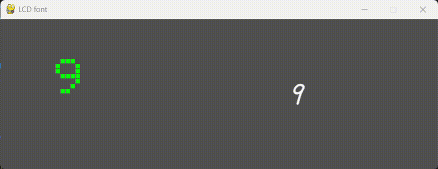

### code0 = int((x / 8) % 10)
code0の定義

### code1 = int((((x / 8)-code0) % 100) // 10)
code1の定義

### text1, rect1 = font1.render(str(1*code0), WHITE)
（大事）str(1*・・・)の「1」*は位を変化させる。10*にすると10の位が変化する
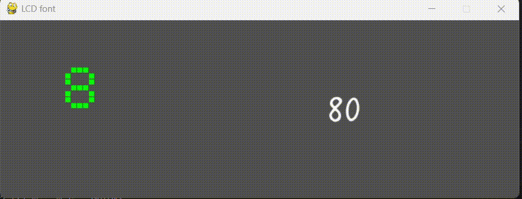

code0は小さい白い数字の変化
code1にすると
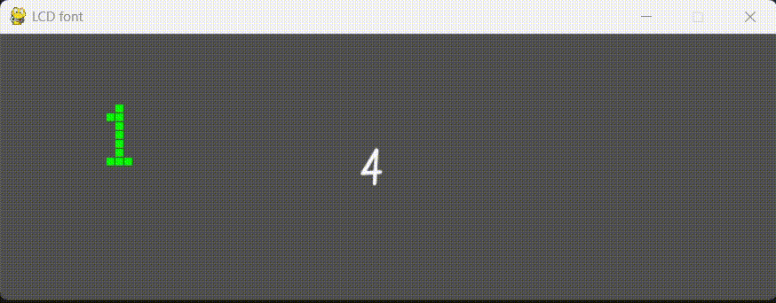
となる
さっきのと合わせたら10の位が変化
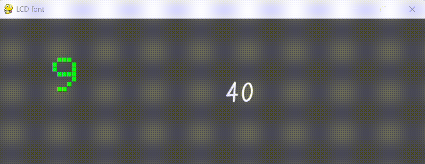
→上の定義ではcode0は大きい緑色の数字と同じ数字になり
code1は内部で1ずつ進んでいるので、1秒ごとに数字が変化しているように見えるようになる
とわかる

(1*code0)のあとに+code0をつけると
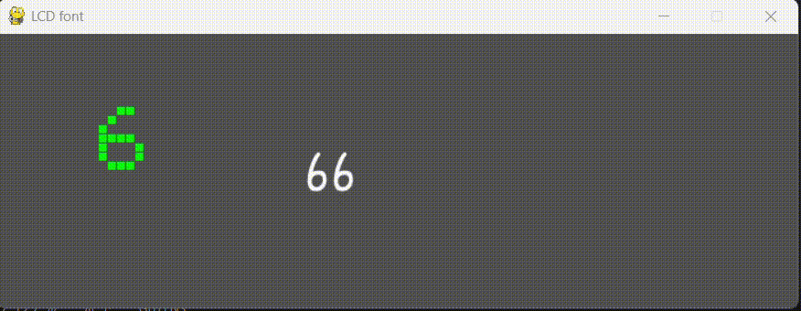
となる。
なので、(10*code1)+code0にすると
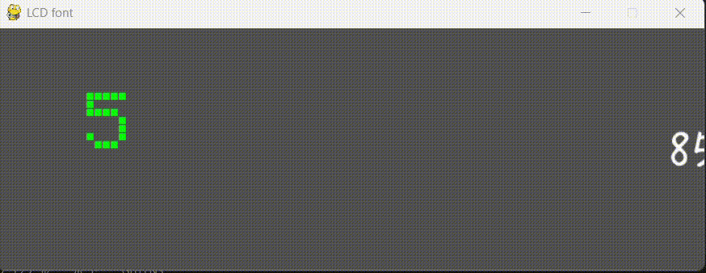
0~100までの数字が表示されるようになった。

※注意　(10*code1)+code0の部分は((10*code1)+code0)のように()をつけること。

WHITEの部分は単純に色を変えられる。
種類はdemo_LCD_font.pyの8~14行の中から選べる。

Before
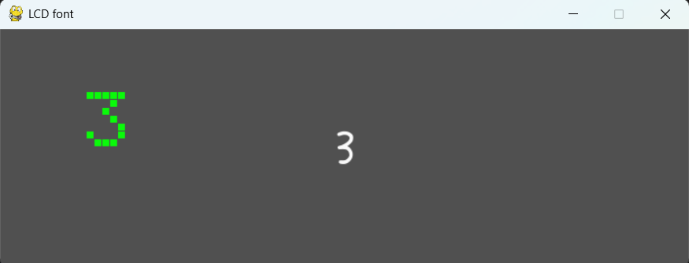
After (RED)
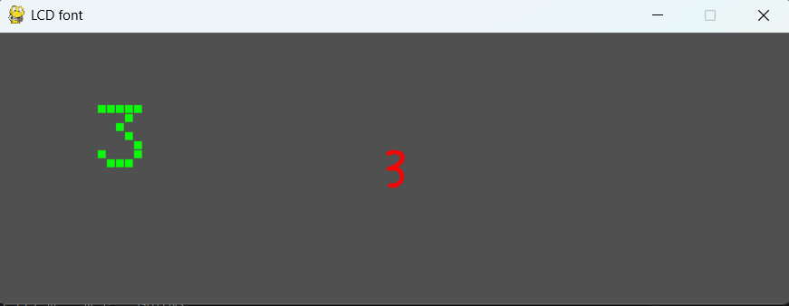

### lcd1.update_col(col=0, code=code0)
一様もう一度基準を貼っておく

col=0は大きい数字の座標を変えられる。
BEfore

After (col=10)
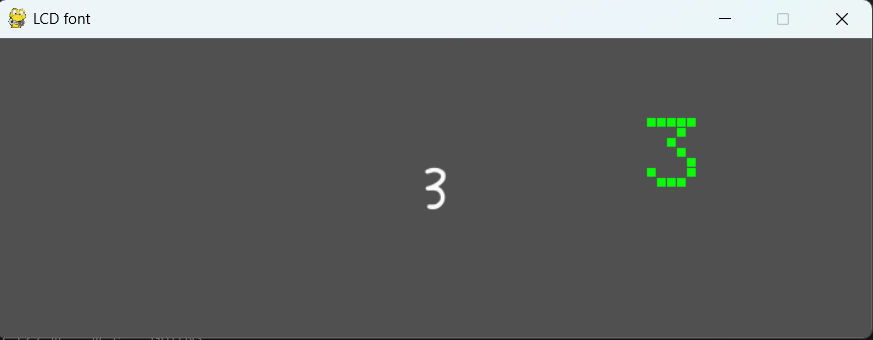

code=code0は大きい数字の表示を変えられる。
<video controls src="20250426-1203-38.4948018.mp4" title="Title"></video>　の内容

→基本的なルールは小さい数字と同じ

なので下にlcd1.update_col(col=0, code=code0)を付け足してみると
<video controls src="画面録画 2025-04-26 205316.mp4" title="n"></video>　の内容
となる。

そして、小さい方も10の位を増やす((10*code1)+code0)と
<video controls src="20250426-1156-33.7963243.mp4" title="Title"></video>　の内容

大きい数字と小さい数字が同じ数表示されるようになった。