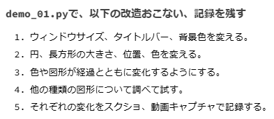
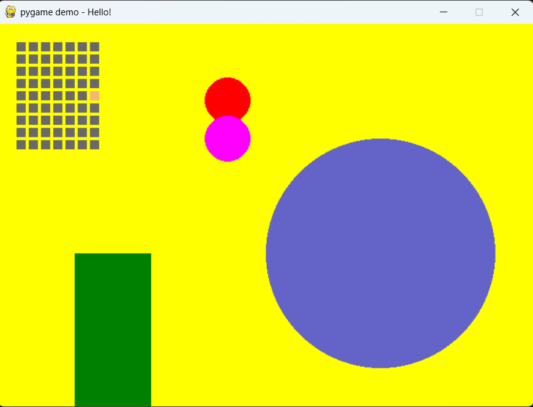
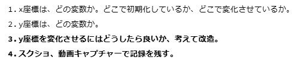
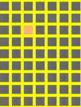
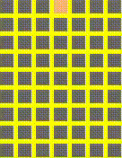
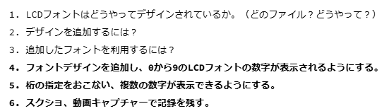

# pygame_samples
## demo_01.py

### ステップ２

 
 ウィンドウの大きさ
 前
>~~~
>screen = pygamne.display.set_mode([640,480])
>~~~
後
>~~~
>screen = pygame.display.set_mode([700, 500])
>~~~

ウィンドウの名前
前
>~~~
>pygame.display.set_caption("pygame demo - window title here")
>~~~
後
>~~~
>pygame.display.set_caption("pygame demo - Hello!")
>~~~

ウィンドウの背景の色
前
>~~~
>screen.fill((238, 238, 170))
>~~~
後
>~~~
>screen.fill((255, 255, 0))
>~~~

図形の（左から）色、座標、大きさ
大きい円 前
>~~~
>pygame.draw.circle(screen, (176, 176, 222), (500, 240), 120)
>~~~
大きい円　後
>~~~
>pygame.draw.circle(screen, (100, 100, 200), (500, 300), 150)
>~~~
小さい円（二つ）　前
>~~~
>pygame.draw.circle(screen, (222, 176, 222), (120, 120), 20)
>pygame.draw.circle(screen, (222, 176, 222), (120, 120), 20)
>~~~
小さい円　後
>~~~
>pygame.draw.circle(screen, (255, 0, 0), (300, 100), 30)
>pygame.draw.circle(screen, (255, 0, 255), (300, 150), 30)
>~~~
四角　前
>~~~
>pygame.draw.rect(screen, (120, 120, 120), Rect(120, 120, 200, 120))
>~~~
四角　後
>~~~
>pygame.draw.rect(screen, (0, 128, 0), Rect(100, 100, 100, 200))
>~~~

動く点（四角）のon offの色
>~~~
>color_on = (248, 180, 120)
>color_off = (105, 105, 105)
>~~~

動く点（四角）の縦、横の数
横
>~~~
> for x0 in range(7):
>~~~
縦
>~~~
>for y0 in range(9):
>~~~

Before

After

### ステップ３

x座標を増やす（点を動かす）
>~~~
>x1 += 1
>~~~

端についたら下の段に行くようにする　前
>~~~
>if x1 > 4:
>    x1 = 0
>~~~
後
>~~~
>if x1 > 6:
>    x1 = 0
>    y1 += 1
>~~~

一番下についたら一番上に戻る
>~~~
>if y1 > 8:
>    y1 = 0
>~~~

Before

After

### demo_LCD_font.py
#### ステップ４

ウィンドウの大きさ
前
>~~~
>WINDOW_WIDTH = 320
>WINDOW_HEIGHT = 240
>~~~
後
>~~~
>WINDOW_WIDTH = 700
>WINDOW_HEIGHT = 240
>~~~

小さい数字の座標移動
前
>~~~
>x_change = 0
>~~~
後
>~~~
>x_change = 1
>~~~

右端についたら左へ戻る
前
>~~~
>if x < 0:
>            x = 0
>~~~
後
>~~~
>if x > 690:
>            x = 0
>~~~

あ